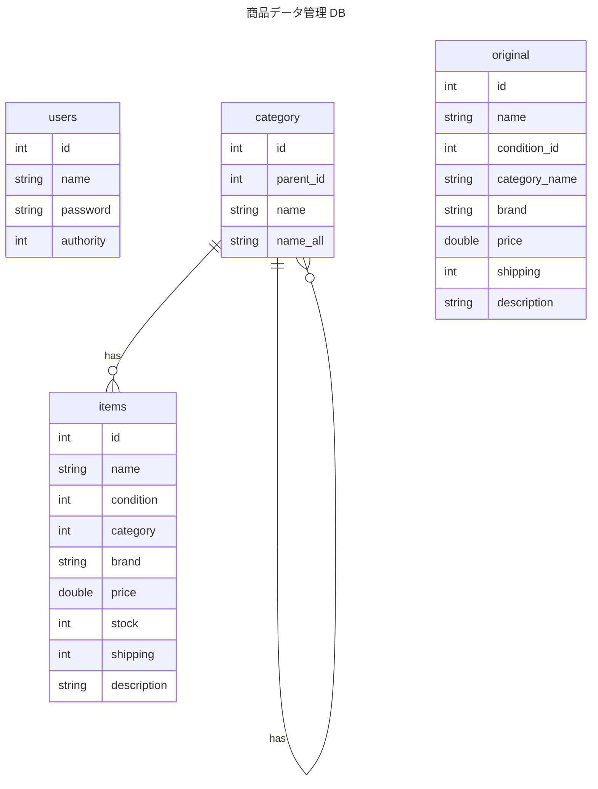

# 商品データ管理システム演習

## TSV データの取り込み

TSV データをデータベースに取り込みます。レコードの取り込みは SQL を使っても Java を使っても構いません。やりやすい方で取り込んでください。

### 1. DB の準備

[ER 図](#er-図) の内容を参考に、DDL を作成してください。

DDL には、以下のテーブルを含めてください。DB 名は自由に決めてください。

- original
- category
- items
- users

### 2. TSV ファイルのデータを original テーブルに取り込む

TSV ファイルの全レコードを、original テーブルに挿入してください。

### 3. original テーブルから category テーブルにレコードを取り込む

original テーブルから category テーブルにカテゴリ情報を取り込んでください。

original テーブルには `/` 区切りで商品のカテゴリが記載されたカラムがあります。

```plaintext
Men/Tops/T-shirts
```

これらを次の形式で category テーブルに格納してください。

| id  | name    | parent_id | name_all          |
| --- | ------- | --------- | ----------------- |
| 1   | Men     | null      | null              |
| 2   | Tops    | 1         | null              |
| 3   | T-shirt | 2         | Men/Tops/T-shirts |

- 最上位カテゴリの `Men` には、parent_id、name_all に `null` を設定
- 次のカテゴリである `Tops` には、親である `Men` の id が parent_id として入り、name_all は `null` を設定
- 最下位カテゴリである `T-shirts` の parent_id は `Tops` の id が入り、name_all には**上層カテゴリの name をスラッシュで連結した文字列**を設定

ただし、original テーブル上のデータでカテゴリが 4 つ以上に分解できるデータについては、3 つ目のカテゴリまでを category テーブルに格納してください。

```plaintext
例:
Men/Clothes/Tops/T-shirts
-> Men/Clothes/Tops までカテゴリテーブルに追加する。T-shirts は追加しない。
```

### 4. original テーブルから items テーブルにレコードを取り込む

original テーブルから items テーブルに商品情報を取り込んでください。
`original.conditino_id` は、値をそのまま `items.condition` に設定してください。

### ER 図



TSV データの取り込みは、ここまでで完了です。
[戻って](../../README.md)、次の演習に進んでください。
